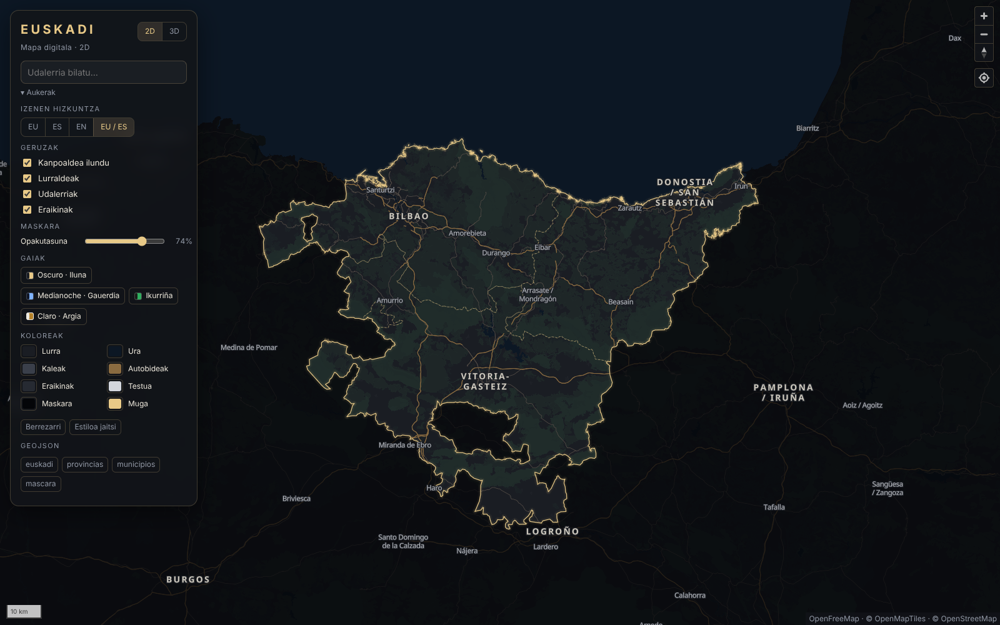
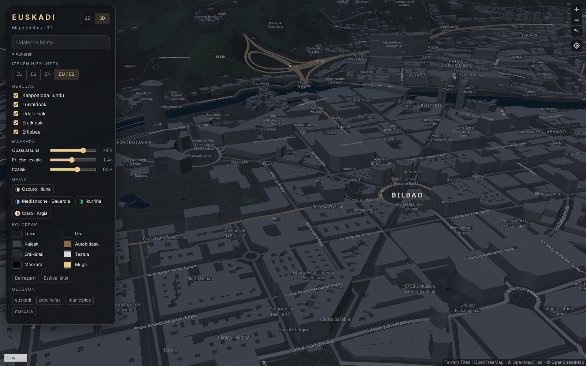
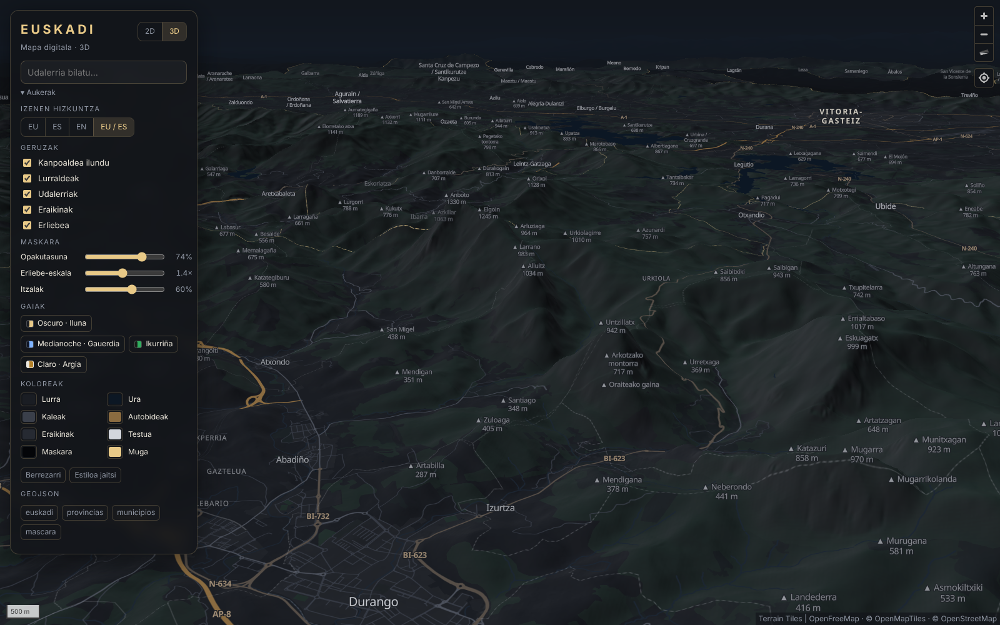
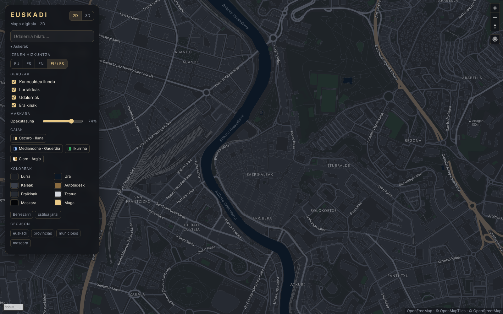
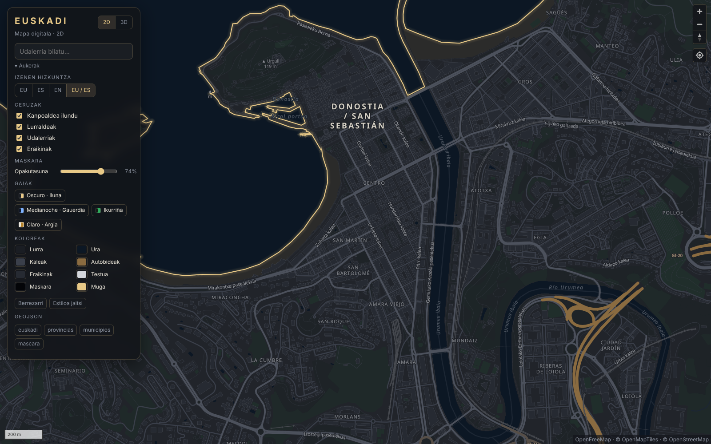
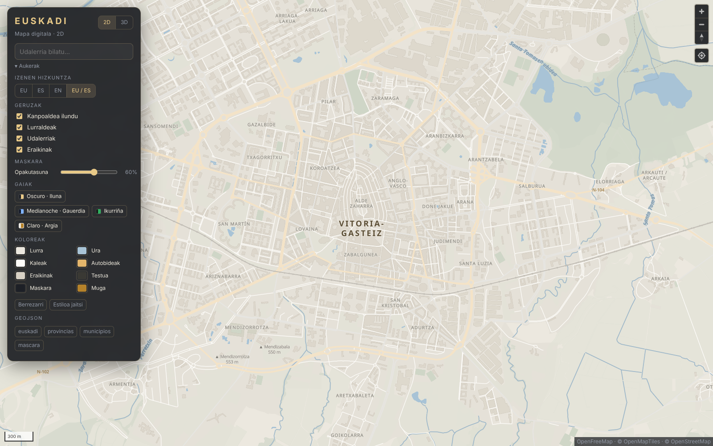
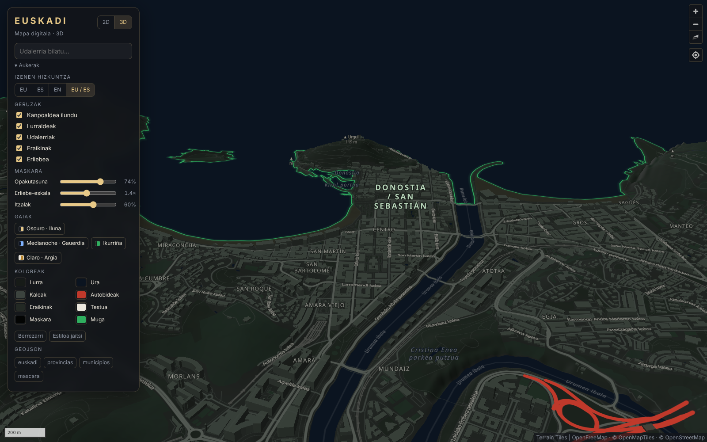
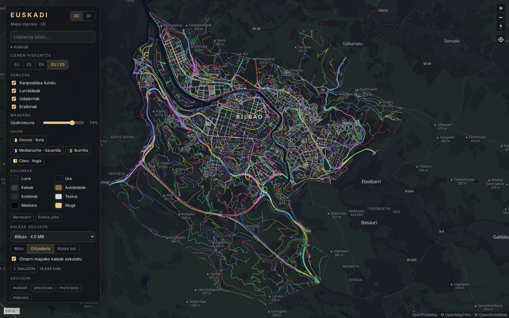
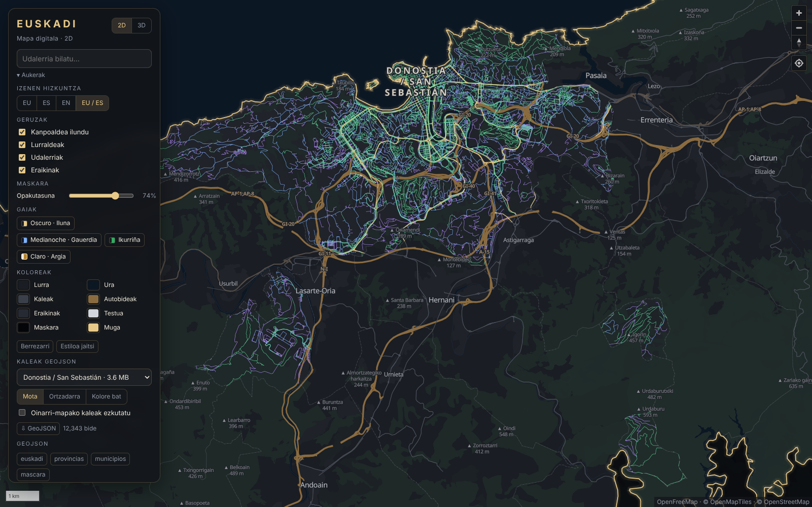

# Euskadi · Digital Map


A dark, elegant digital map of the Basque Country (Euskadi) showing **every street** from OpenStreetMap, in **2D and 3D**. Land outside Euskadi is darkened and the sea is not. You can change the mask and the colours from the map itself.

**➜ 2D map:** https://mapa.ortzigar.org
**➜ 3D map:** https://mapa.ortzigar.org/3d.html



| 3D · Bilbao | 3D · Anboto / Urkiola |
|---|---|
|  |  |
| **2D · Bilbao** | **2D · Donostia** |
|  |  |
| **Theme “Claro” · Vitoria-Gasteiz** | **Theme “Ikurriña” · 3D Donostia** |
|  |  |


| Street GeoJSON · Bilbao (rainbow) | Street GeoJSON · Donostia (by type) |
|---|---|
|  |  |

---


### Features

- **2D** (`index.html`) and **3D** (`3d.html`) versions. You can switch between them with the 2D / 3D buttons, and the map keeps its position.
- **Every street, building and place name** from OpenStreetMap, using free vector tiles from [OpenFreeMap](https://openfreemap.org) (no API key).
- **3D mode**: real terrain elevation, hillshading, extruded buildings with real heights, and fog on the horizon.
- **Outside mask**: neighbouring land is darkened (Cantabria, Burgos, La Rioja, Navarre, Iparralde…). This includes the Treviño and Villaverde de Trucios enclaves. The sea is never darkened.
- **Customise from the map panel**:
  - Mask colour and opacity, and an on/off switch
  - Colours for land, water, streets, motorways, buildings, text, mask and border
  - Four themes: *Oscuro* (dark), *Medianoche* (midnight), *Ikurriña* and *Claro* (light)
  - 3D: terrain scale and hillshade strength
  - **Download style** saves your customised style as a MapLibre JSON file
  - Your settings are saved in your browser
- Municipality **search**. Click a municipality to see its province, population and INE code.
- Label language: **EU**, **ES**, **EN** or **EU / ES** (the official, often bilingual, name).
- **Streets as GeoJSON**: pick a municipality in the panel to load every street, road and path as GeoJSON. You can colour them by type, in rainbow colours (one per street) or in a single colour, hide the base map streets, click a street to see its name, and download the file.
- Shareable URLs: the position is stored in the `#hash`. `?tema=claro` picks a theme and `?lang=en` picks a language. `?calles=bilbao&modo=arcoiris&base=0` opens Bilbao's streets in rainbow colours without the base map streets.

### GeoJSON files

GitHub shows any `.geojson` file as an interactive map, so you can preview these directly in the repo.

| File | Contents |
|---|---|
| [`data/euskadi.geojson`](data/euskadi.geojson) | Boundary of the Basque Autonomous Community |
| [`data/provincias.geojson`](data/provincias.geojson) | Araba/Álava, Bizkaia and Gipuzkoa |
| [`data/municipios.geojson`](data/municipios.geojson) | All 252 municipalities and 9 *partzuergoak* (communal lands) |
| [`data/mascara.geojson`](data/mascara.geojson) | Mask: the surrounding land that is **not** Euskadi (sea excluded) |
| [`estilo/euskadi-oscuro.json`](estilo/euskadi-oscuro.json) | Dark MapLibre GL style |

Municipality properties:

```json
{ "nombre": "Agurain / Salvatierra", "izena_eu": "Agurain", "nombre_es": "Salvatierra",
  "ine": "01051", "poblacion": "5173", "provincia": "Araba / Álava",
  "tipo": "municipio", "admin_level": 8, "osm_id": 340918, "wikidata": "Q398698" }
```

`tipo` is either `municipio` or `partzuergoa` (communal land that belongs to no municipality, such as Enirio-Aralar).
Coordinates are in WGS84 (EPSG:4326).

#### Streets per municipality — `data/calles/`

One GeoJSON file per municipality with **every way tagged `highway`** in OpenStreetMap (streets, roads, footpaths, paths, steps…), clipped to the municipal boundary. The **191 municipalities with 500 or more inhabitants** are included (about 251,000 ways). [`data/calles/index.json`](data/calles/index.json) lists them with their province, size and bounding box. When you search for a municipality in the map, its streets load automatically.

```json
{ "type": "Feature",
  "properties": { "id": 11505371, "highway": "primary", "nombre": "Salbe zubia / Puente La Salve",
                  "izena_eu": "Salve zubia", "nombre_es": "Puente La Salve", "oneway": "yes", "puente": "yes" },
  "geometry": { "type": "LineString", "coordinates": [[-2.93134, 43.27007], …] } }
```

```js
const r = await fetch("https://cdn.jsdelivr.net/gh/ortzigaraio/Euskadi-Mapa-digital-@main/data/calles/bilbao.geojson");
const calles = await r.json();
```

To add the smaller municipalities too, run `python3 scripts/build_calles.py --min 0`. For specific ones, run `python3 scripts/build_calles.py Zumaia Bermeo` (by name or OSM id).

Idea inspired by [amoraschi/spain-cities-geojson](https://github.com/amoraschi/spain-cities-geojson). These files are generated independently from OpenStreetMap: they also cover Donostia and every Basque municipality with 500+ inhabitants, include the street names in Basque and Spanish, and take up about half the size.

### Use it in your project

**MapLibre GL JS** (the same map as the website):

```html
<link rel="stylesheet" href="https://unpkg.com/maplibre-gl@5.24.0/dist/maplibre-gl.css">
<script src="https://unpkg.com/maplibre-gl@5.24.0/dist/maplibre-gl.js"></script>
<div id="map" style="height:100vh"></div>
<script>
  const BASE = "https://cdn.jsdelivr.net/gh/ortzigaraio/Euskadi-Mapa-digital-@main/";
  fetch(BASE + "estilo/euskadi-oscuro.json").then(r => r.json()).then(style => {
    for (const s of Object.values(style.sources))           // make data/*.geojson absolute
      if (s.type === "geojson") s.data = BASE + s.data;
    new maplibregl.Map({ container: "map", style, center: [-2.62, 43.04], zoom: 8.5 });
  });
</script>
```

Or copy `index.html`, `3d.html`, `css/`, `js/`, `estilo/` and `data/` to your own site.

**Leaflet** (just the mask and border, over any base map):

```js
const BASE = "https://cdn.jsdelivr.net/gh/ortzigaraio/Euskadi-Mapa-digital-@main/data/";
fetch(BASE + "mascara.geojson").then(r => r.json()).then(g =>
  L.geoJSON(g, { style: { stroke: false, fillColor: "#000", fillOpacity: 0.7 } }).addTo(map));
fetch(BASE + "euskadi.geojson").then(r => r.json()).then(g =>
  L.geoJSON(g, { style: { color: "#e8c987", weight: 2, fill: false } }).addTo(map));
```

**QGIS / Python**: drag the `.geojson` files into QGIS, or use `geopandas.read_file(...)`.

### Run locally

Start `python3 -m http.server 8000` in the repo folder and open http://localhost:8000.

### Rebuild the data

```bash
pip install shapely osmium
python3 scripts/build_data.py      # boundaries, municipalities and mask from OpenStreetMap
python3 scripts/build_calles.py    # streets of municipalities with 500+ inhabitants (from the OSM extract)
node scripts/capturas.mjs          # preview images in img/ (needs Playwright and a local server)
```

The mask is built from the neighbouring provinces and regions. Their boundaries follow the coastline, so the sea is never included. Beyond that area the viewer darkens everything and then repaints the ocean on top.

### Project layout

```
index.html            2D viewer
3d.html               3D viewer
js/mapa.js            shared viewer code (themes, colours, mask, search, 3D)
css/mapa.css          viewer styles
estilo/               MapLibre style
data/                 GeoJSON (data/calles/: streets per municipality)
scripts/              data and screenshot generators
img/                  previews
```

### Licences

- Code and style: [MIT](LICENSE).
- Data (GeoJSON and tiles): © [OpenStreetMap](https://www.openstreetmap.org/copyright) contributors, [ODbL](https://opendatacommons.org/licenses/odbl/). If you use it, credit “© OpenStreetMap contributors”.
- Tiles: [OpenFreeMap](https://openfreemap.org) · [OpenMapTiles](https://www.openmaptiles.org/).
- Elevation (3D): [Terrain Tiles](https://github.com/tilezen/joerd/blob/master/docs/attribution.md) (Mapzen / AWS Open Data).

